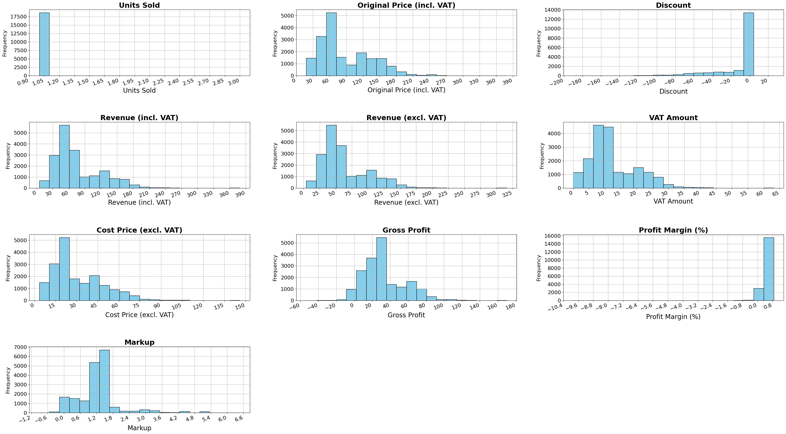
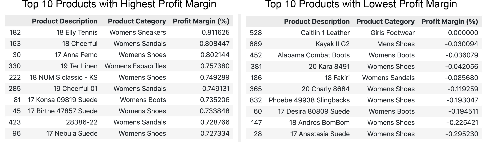
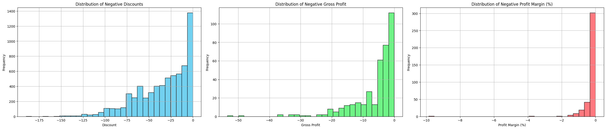
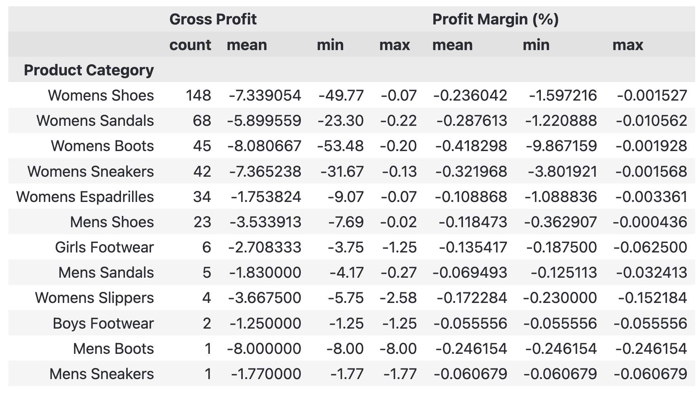

# Project Background
White Wolf Agencies LTD, established in 2007, is a small independent retail company focused on footwear products. It operates two physical retail stores in South-West London and Haslemere, Surrey, along with an e-commerce site. This project leverages transactional sales data from both the EPOS and e-commerce platform to extract actionable insights supporting White Wolf Agencies' commercial success.

By analyzing key metrics—such as revenue, profit margins, and units sold—this project offers targeted recommendations for optimizing stock levels, identifying profitable product lines, and refining pricing strategies to address seasonal demand variability. These insights aim to enhance White Wolf Agencies' operational efficiency by improving inventory management, minimizing stockouts, and better aligning stock levels with demand.

Insights and recommendations are provided on the following key areas:

- **Sales Performance and Profitability** 
- **Pricing and Discount Strategy** 
- **Inventory Optimisation** 
- **Seasonal and Demand Analysis** 

The SQL query used to combine the two views into a table can be found here [link].

# Data Structure & Initial Checks

The company's main database structure as seen below consists of over 80 individual tables. For the purpose of this project two views, each aggregating data from multiple tables were used. Together, these views provide a unified structure of the dataset with essential fields for transactional analysis. The total row count is 21,138 records before data cleaning (18,636 records after data cleaning). A description of each view is as follows:

- **vBI_Item:** - This view consolidates data related to individual product items, pulling from various tables to provide key attributes such as SKU, style number, description, size, color, brand, main group, subgroup, season, and cost price.
For this analysis, only the fields containing item descriptions, style numbers, sizes, and colors were used to focus on product-specific attributes needed for categorization and trend identification.

- **vBI_SalesRecords:** - This view compiles transactional sales data, drawing from multiple tables to provide comprehensive sales details. Key fields include the sale date, main product group, subgroup, brand name, season, quantity sold, discount, VAT amount, branch name, and an indicator for online sales.
To streamline the analysis, only fields directly relevant to transaction summaries, pricing, VAT, and branch-specific details were retained.

[Entity Relationship Diagram here]

# Executive Summary

### Overview of Findings

Pricing and Profit Margins: Price markups are on average 1.25 times the cost, but certain high-margin items drive profitability more than others.

Seasonal Sales Patterns: A clear trend shows demand variation across seasons, with Autumn/Winter products like boots and coats generating higher revenue.

Branch Performance: The Barnes location significantly outperforms Haslemere in revenue, although Haslemere achieves a higher average profit margin per sale.

[Visualization, including a graph of overall trends or snapshot of a dashboard]

# Insights Deep Dive
### Detailed Sales Metrics and Profitability Analysis

* **Transaction Volume and Unit Sales:**	The majority of sales transactions involve a single unit, with occasional sales involving 2 or 3 units. This suggests a high frequency of individual purchases.
  
* **Transaction Value and Revenue Distribution:** The average transaction value is £88.15, ranging from £18 to £379. Most transactions fall within the £60-£70 range for nearly 4,000 items, followed by £40-£50 for 2,500 items, and £70-£80 for over 2,000 items. This distribution shows that revenue is driven by a high volume of lower-value transactions, supporting a volume-driven business model.

* **Discounting and Pricing Strategy:** The average product discount during sales is £12.26, with most products sold at full price. This selective discounting approach suggests a minimal reliance on discounting for sales. The average markup on products is 1.25 times the cost, indicating a pricing strategy that targets a 25% profit above cost.

* **Profitability and Gross Profit Analysis:** The mean gross profit per transaction is £32.90, with most transactions generating a gross profit of £40 (3,700 transactions) or £50 (3,400 transactions). Profit margins range from -9.87% to 86.60%, averaging 49.4%, showing variability in profitability and some unprofitable sales.

* **Profit Margin and Markup Distribution:** Profit margins are mostly within the 40%-60% range, with a skew towards higher margins, indicating a sound pricing strategy that ensures profitability across a diverse range of products. Most products have a markup below 2, with an average markup of 124%. The markup distribution is concentrated in the 140%-150% range for about 5,000 transactions and the 120%-130% range for nearly 4,000 transactions, indicating a consistent yet strategic approach to maximizing profitability.

* **Cost and VAT Analysis:** The average product cost price is £31, with most costs between £20-£30 for around 3,400 items, followed by £30-£40 (2,600 items) and £10-£20 (2,500 items). VAT per transaction averages £12.26, ranging from £0 (for VAT-exempt children’s items) to £63.

### Profit Margin Insights Across Product Lines

* **Top-Performing Products.** The most profitable products include "Elly Tennis," "Cheerful," "Anna Femo," "Ter Linen," "Numis," "Konsa," "Birthe," and "Nebula," with profit margins ranging from 72.7% to 81.1%. These products, mainly in the women's footwear category (especially sandals and sneakers), highlight a strong market position and effective pricing strategy within this segment.
  
* **Break-Even Sales Strategy** "Caitlin 1 Leather" in Girls' Footwear is sold at cost, resulting in a 0% profit margin. This approach may reflect a strategic decision focused on market penetration or customer acquisition rather than immediate profitability.
  
* **Products with Negative Margins.** Some products, such as "Kayak II G2" in Men's Shoes and "Alabama Combat Boots" in Women's Boots, are sold at a loss, indicating negative profit margins. Factors like input overpricing, production inefficiencies, or competitive pricing pressures might contribute to these losses.

* **Underperforming Product Review:** "Anastasia Suede" in Women's Shoes stands out with the lowest profit margin at -29.52%, likely due to heavy discounting or cost mismanagement. This significant loss highlights a need for a pricing or cost strategy reassessment.

* **Profitability Variations Across Categories:** Both women's and men's footwear categories feature products with minimal or negative margins, indicating inconsistent profitability. This variation suggests opportunities to refine pricing and cost strategies, especially for underperforming items.

### Profitability Challenges and Strategic Insights

* **Negative Discounts** There are 6,621 transactions with negative discounts, averaging -£34.59 per transaction. This significant amount indicates a potential issue with discounting practices. The majority of these discounts range between £-10 and £-55, suggesting a trend that may require review to ensure discounting aligns with profitability goals.
  
* **Negative Gross Profit** 379 transactions show negative gross profit, with an average loss of -£6.21 per transaction. The largest recorded loss in a single transaction is -£53.48. These results indicate instances where sales fail to cover costs, typically resulting in small losses ranging from £-10 to £-30. Addressing these patterns could prevent frequent losses at the transaction level.
  
* **Negative Profit Margins** Profit margins average -0.25%, which, although it may appear minor, could have significant impacts depending on sales volume. Margins range from -9.87% to 0.000436%, indicating variability in product or transaction performance. Addressing these variations can help in achieving a healthier overall profit margin.

### Category-Level Insights: Contributors to Negative Profit

* **Women's Shoes** This category records the highest number of transactions with negative gross profit, totaling 148 transactions. These frequent losses suggest that products in this category may be priced below cost, necessitating a reassessment of pricing strategies.
  
* **Women's Boots** Women's Boots not only have a high frequency of transactions with negative gross profit but also show the most extreme negative profit margins (minimum of -9.87%) and an average gross profit loss of -£8.08. These trends point to significant losses, possibly due to pricing or demand factors specific to this category.
  
* **Other Categories** Men's Boots and Men's Sneakers each have one transaction showing substantial losses in both gross profit and profit margin. Although isolated, these instances may reflect critical pricing or cost management issues.

{: width="50%"}

# Recommendations:

Based on the insights and findings above, we would recommend the stakeholder to consider the following: 

* Optimizing Inventory and Cash Flow:
* **Evaluate forward ordering practices for seasonal items like boots and sandals.**
* **Implement demand forecasting to reduce excess and ensure adequate stock levels.**
  
* Refining Pricing Strategies:
* Dynamic pricing on high-demand items: Introduce price flexibility for high-demand items to balance volume with profitability.
* Focused discounting: Apply targeted discounts to clear slow-moving items, avoiding markdowns on consistently profitable lines.
  
Branch-Level Strategy:

Leverage Haslemere’s high margin: Despite lower volume, Haslemere’s profitability indicates potential for premium pricing on select products.
Marketing push for Barnes: Enhance promotional efforts to maintain high sales volume while slightly increasing profit margins.
Data-Driven Tools for Decision Making:

Utilize machine learning for pricing model adjustments based on sales patterns and seasonality.
Explore customer segmentation to create tailored promotions based on purchase behaviors.
  

# Assumptions and Caveats:

Throughout the analysis, multiple assumptions were made to manage challenges with the data. These assumptions and caveats are noted below:

* Assumption 1: Seasonal data gaps: December 2021 data was partially imputed using December 2020 trends.
  
* Assumption 2: Negative discount interpretation: High negative discounts were assumed to represent clearance markdowns.
  
* Assumption 3: Exclusion of non-sensical refund dates: Refunds with incorrect dates were excluded from the analysis, totaling about 3% of the data.
