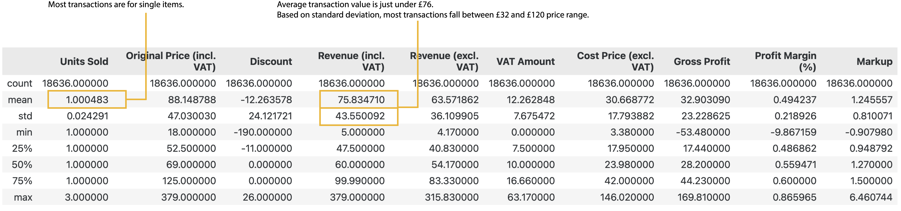

# Project Background
White Wolf Agencies LTD, established in 2007, is a small independent retail company focused on footwear products. It operates two physical retail stores in South-West London and Haslemere, Surrey, along with an e-commerce site. This project leverages sales data from these platforms to extract actionable insights supporting White Wolf Agencies' commercial success.

By analyzing key metrics—such as revenue, profit margins, and units sold—this project offers targeted recommendations for optimizing stock levels, identifying profitable product lines, and refining pricing strategies to address seasonal demand variability. These insights aim to enhance White Wolf Agencies' operational efficiency by improving inventory management, minimizing stockouts, and better aligning stock levels with demand.

Insights and recommendations are provided on the following key areas:

- **Sales Performance and Profitability** 
- **Pricing and Discount Strategy** 
- **Inventory Optimisation** 
- **Seasonal and Demand Analysis** 

The SQL query used to combine the two views into a table can be found here [link].

# Data Structure & Initial Checks

The companies main database structure as seen below consists of over 60 tables. For the purpose of this project two views, each aggregating data from multiple tables were used. Together, these views provide a unified structure of the dataset with essential fields for transactional analysis. The total row count is 21,138 records before data cleaning (18,636 records after data cleaning). A description of each view is as follows:

- **vBI_Item:** - This view consolidates data related to individual product items, pulling from various tables to provide key attributes such as SKU, style number, description, size, color, brand, main group, subgroup, season, and cost price.
For this analysis, only the fields containing item descriptions, style numbers, sizes, and colors were used to focus on product-specific attributes needed for categorization and trend identification.

- **vBI_SalesRecords:** - This view compiles transactional sales data, drawing from multiple tables to provide comprehensive sales details. Key fields include the sale date, main product group, subgroup, brand name, season, quantity sold, discount, VAT amount, branch name, and an indicator for online sales.
To streamline the analysis, only fields directly relevant to transaction summaries, pricing, VAT, and branch-specific details were retained.

[Entity Relationship Diagram here]

# Executive Summary

### Overview of Findings

Pricing and Profit Margins: Price markups are on average 1.25 times the cost, but certain high-margin items drive profitability more than others.

Seasonal Sales Patterns: A clear trend shows demand variation across seasons, with Autumn/Winter products like boots and coats generating higher revenue.

Branch Performance: The Barnes location significantly outperforms Haslemere in revenue, although Haslemere achieves a higher average profit margin per sale.

[Visualization, including a graph of overall trends or snapshot of a dashboard]

# Insights Deep Dive
### Category 1: Sales Performance and Profitability

* **Main insight 1.** Most transactions involve single-unit sales, indicating a focus on lower-value, high-volume sales. The mean transaction revenue is around £76, with a standard deviation of £43.55. That means that about 68% of revenue is between £32.45 and £119.55, while around 95% of transaction revenue falls between £-11.10 and £163.10. In other words, most transactions fall within the £32.45 to £119.55 range.

  
* **Main insight 2.** High-revenue products, particularly "Rain 200" from Women’s Coats, demonstrate the impact of high-margin items. These sales generated consistent revenues and profit margins without discounts, suggesting a valuable pricing model for premium items.
  
* **Main insight 3.** Branch comparison reveals Barnes has a revenue advantage due to higher sales volume, though Haslemere has a 56.9% average profit margin.

  

### Category 2: Pricing and Discount Strategy

* **Main insight 1.** Discounts show varied effectiveness. Negative discounts (refunds or corrections) impact revenue more than volume; positive discounts yield mixed results, not consistently driving unit sales.
  
* **Main insight 2.** Profit margins on discounted items like “18 Elly Tennis” and “18 Cheerful” remain high despite markdowns, underscoring strategic discounting’s role in promoting profitable sales without excessive discount reliance.
* 
* **Main insight 3.** High outliers in markup are found in selective products, suggesting targeted pricing for premium items, allowing a controlled profit margin even when discounts are applied.

[Visualization specific to category 2]

### Category 3: Inventory Optimization

* **Main insight 1.** Seasonal footwear, especially boots and sneakers, performs well, with stockouts and overstock managed carefully around seasonal demand, though late/early deliveries create issues in cash flow.
  
* **Main insight 2.** Categories like Women’s Sandals and Slippers exhibit profitability variability, with underperforming products often affected by overstock or low demand.
  
* **Main insight 3.** Optimal pricing and inventory planning for key items (e.g., “18 Cheerful” sandals) may reduce excess inventory and improve cash flow.

[Visualization specific to category 3]

### Category 4: Seasonal and Demand Analysis

* **Main insight 1.** The analysis shows peak sales in summer (sandals, slippers) and winter (boots, coats), which supports a cyclical stock strategy to anticipate demand shifts.
  
* **Main insight 2.** The seasonal pricing strategy suggests pricing adjustments, particularly in items like "18 Elly Tennis” and “19 Cheerful 01," which align well with seasonal trends but require precise pricing to avoid loss.
  
* **Main insight 3.** Monthly revenue data reveal upward trends in sales volume over time, highlighting growth potential for demand forecasting.

[Visualization specific to category 4]

# Recommendations:

Based on the insights and findings above, we would recommend the stakeholder to consider the following: 

* Optimizing Inventory and Cash Flow:
* **Evaluate forward ordering practices for seasonal items like boots and sandals.**
* **Implement demand forecasting to reduce excess and ensure adequate stock levels.**
  
* Refining Pricing Strategies:
* Dynamic pricing on high-demand items: Introduce price flexibility for high-demand items to balance volume with profitability.
* Focused discounting: Apply targeted discounts to clear slow-moving items, avoiding markdowns on consistently profitable lines.
  
Branch-Level Strategy:

Leverage Haslemere’s high margin: Despite lower volume, Haslemere’s profitability indicates potential for premium pricing on select products.
Marketing push for Barnes: Enhance promotional efforts to maintain high sales volume while slightly increasing profit margins.
Data-Driven Tools for Decision Making:

Utilize machine learning for pricing model adjustments based on sales patterns and seasonality.
Explore customer segmentation to create tailored promotions based on purchase behaviors.
  

# Assumptions and Caveats:

Throughout the analysis, multiple assumptions were made to manage challenges with the data. These assumptions and caveats are noted below:

* Assumption 1: Seasonal data gaps: December 2021 data was partially imputed using December 2020 trends.
  
* Assumption 2: Negative discount interpretation: High negative discounts were assumed to represent clearance markdowns.
  
* Assumption 3: Exclusion of non-sensical refund dates: Refunds with incorrect dates were excluded from the analysis, totaling about 3% of the data.
