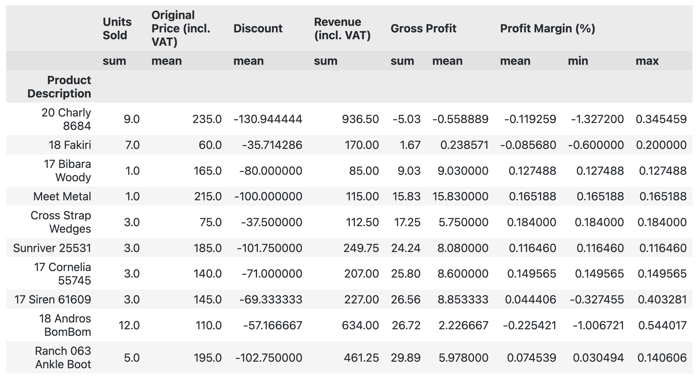
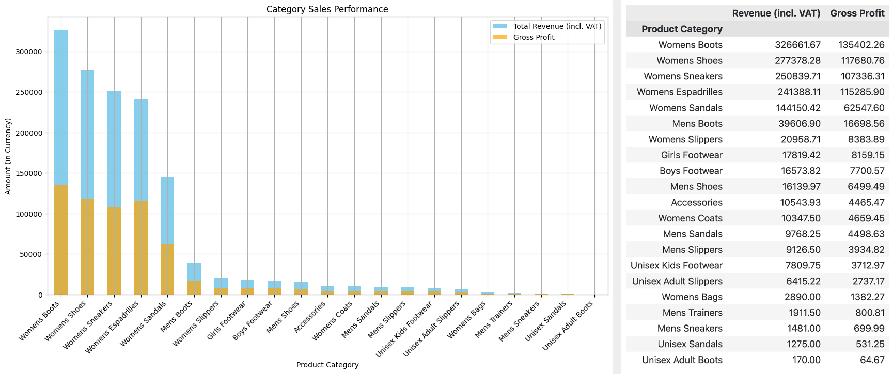
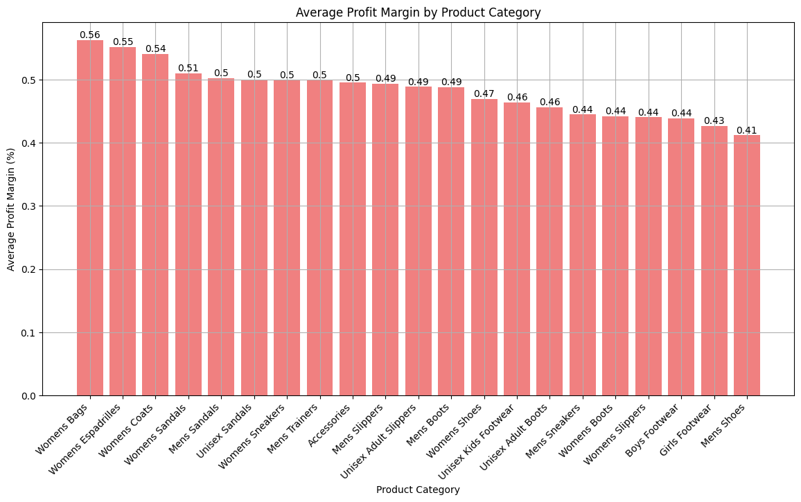
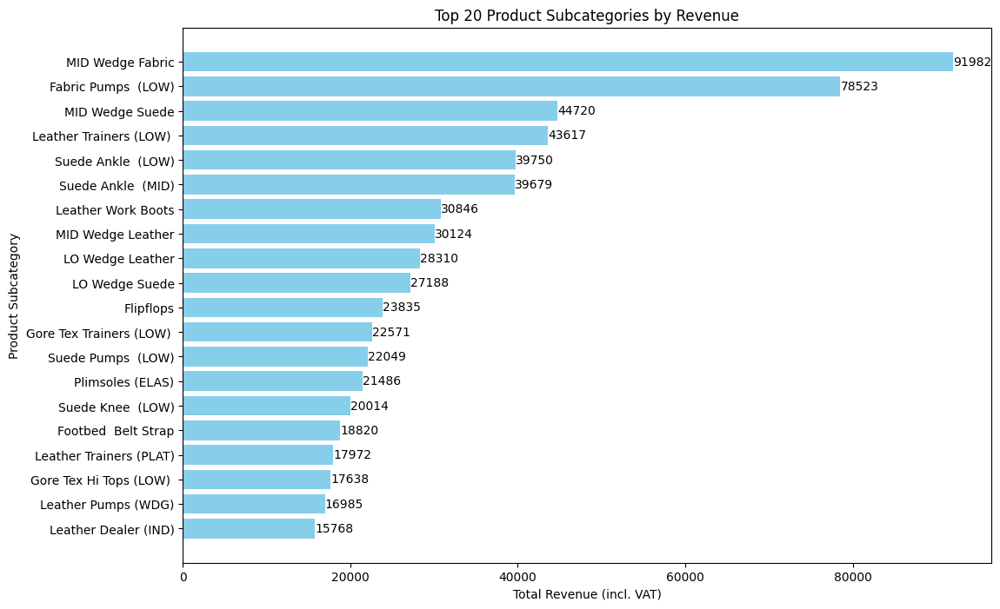
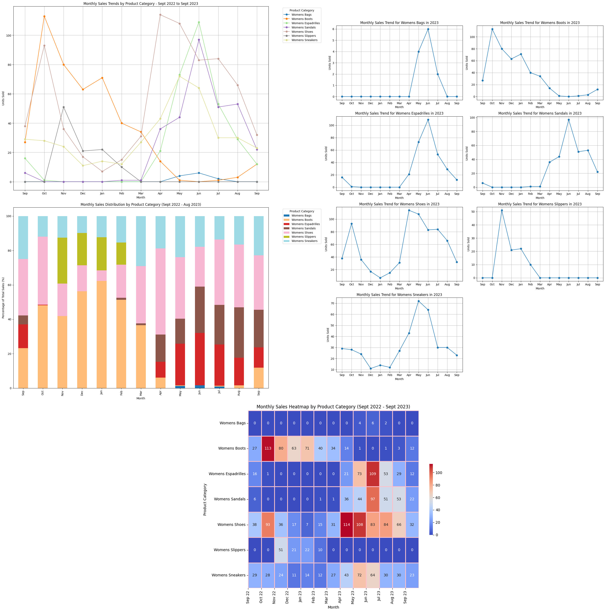

# Optimising Inventory Management Through Data Analysis and Forecasting

## Table of Content

1. [Project Background](#project-background)
2. [Executive Summary](#executive-summary)
3. [Data Sources and Methodology](#data-sources-and-methodology)
   - [Data Sources](#data-sources)
   - [Limitations](#limitations)
   - [Key Columns in the Dataset](#key-columns-in-the-dataset)
   - [Methodology](#methodology)
4. [Insights Deep Dive](#insights-deep-dive)
   - [Sales Metrics and Profitability Analysis](#sales-metrics-and-profitability-analysis)
   - [Profit Margin Insights Across Product Lines](#profit-margin-insights-across-product-lines)
   - [Profitability Challenges and Strategic Insights](#profitability-challenges-and-strategic-insights)
   - [Category-Level Insights: Contributors to Negative Profit](#category-level-insights-contributors-to-negative-profit)
   - [Dissecting the Dynamics of Product Underperformance](#dissecting-the-dynamics-of-product-underperformance)
   - [Cateogry Sales Performance Analysis](#category-sales-performance-analysis)
   - [Profit Margin Performance Breakdown](#profit-margin-performance-breakdown)
   - [Top 20 Product Subcategories by Revenue Analysis](#top-20-product-subcategories-by-revenue-analysis)
   - [Womens Monthly Sales Trends Analysis (AW22 - SS23)](#womens-monthly-sales-trends-analysis-aw22---ss23)
5. [Recommendations](#recommendations)
6. [Assumptions and Caveats](#assumptions-and-caveats)
   - [Assumptions](#assumptions)
   - [Caveats](#caveats)

## Project Background
White Wolf Agencies LTD, established in 2007, is a small independent footwear retailer operating two physical stores and an e-commerce platform. While the company collects significant sales and product data from its EPOS and Shopify systems, this data has remained underutilized.

This project thoroughly analyzes and synthesizes this data to improve **sales performance**, **enhance operational efficiency**, and refine **inventory management** strategies. By focusing on key metrics—**revenue**, **profit margins**, **order volume**, and **seasonal trends**—the analysis delivers data-driven recommendations to optimize business strategies and align operations with customer demand.

Insights and recommendations are provided on the following key areas:

- **Sales Trends Analysis**: Evaluating historical sales patterns, emphasizing revenue, order volume, and average order value (AOV).

- **Product Level Performance**: Analyzing product lines to identify their impact on sales and returns.
  
- **Sales Performance and Profitability**: Highlighting top-performing and underperforming product lines.
  
- **Pricing and Discount Strategy**: Assessing pricing strategies and the effects of discounting on performance.
  
- **Seasonal and Demand Analysis**: Identifying seasonal trends to forecast demand and inform stock planning.

The insights derived from this project will serve as a foundation for the company’s future strategies, enabling White Wolf Agencies to improve both its physical and e-commerce operations while delivering an enhanced customer experience.

## Executive Summary

### Overview of Findings

The analysis highlights a **volume-driven business model**, where most transactions involve single units, with an average transaction value of **£88.15**. Revenue is primarily driven by mid-priced items (**£60–£70**) and supported by a **consistent pricing strategy**, featuring minimal discounts and an average markup of **1.25x**, resulting in steady profit margins averaging **49.4%**.

* **Top Performers:** Women's footwear—particularly **sandals**, **sneakers**, and **boots**—stands out as the top-performing category, significantly contributing to both **revenue** and **profitability**, with some products achieving margins exceeding **72%**.
  
* **Challenges:** Certain product lines, such as **Women’s Boots** and **Shoes**, struggle with **negative margins** due to excessive discounting and cost inefficiencies. Over **6,600 transactions** reported discounts averaging **-£34.59**, impacting overall profitability.
  
* **Seasonality**: Sales are highly seasonal, with Autumn/Winter collections showing significant peaks in demand. However, off-seasons see sharp declines, especially in categories like boots and sandals.
  
* **Branch and Channel Dynamics:** Offline sales dominate, with the Barnes branch consistently outperforming. Online sales remain underuitilised, presenting an opportunity for growth.
  
* **Customer Preferences:** Products priced between **£60** and **£150** dominate sales, while niche premium items contribute disproportianately to revenue but serve a smaller audience.

## Data Sources and Methodology

### Data Sources

The data utilized for this project spans sales transactions from 2017 to 2024, extracted from the company’s sales records. The dataset includes information across multiple dimensions:
  
* **Scope**: Transactions across two branches (Barnes and Haslemere) and online sales channels.
  
* **Granularity**: Detailed attributes such as product category, subcategory, pricing, discounts, revenue, cost, and profit margins.

The company’s database comprises **over 80 tables**, from which two aggregated **views** were utilized for this project. These views provide a unified and streamlined dataset essential for transactional analysis. The dataset initially contained **21,138 records** and was refined to **18,636 records** after data cleaning.

The dataset was derived from two aggregated views within the company’s database:
* **vBI_Item**: Provided product-specific attributes (e.g., SKU, style, size, color, brand, and cost price) essential for trend and category analysis.
  
* **vBI_SalesRecords**: Consolidated transactional data (e.g., sale date, discount, VAT, branch name, and online sales indicator) critical for sales performance evaluation.

### Limitations

While the dataset provides a comprehensive view of sales transactions, several limitations were encountered:

1. **Data Gaps**: Missing values in categorical columns like product descriptions, brand names, and subcategories.
2. **Outliers**: Extreme values in discounts and profit margins, potentially skewing certain analyses.
3. **Seasonal Bias**: Some periods, particularly newer seasons like Spring/Summer 2024, lacked sufficient data for complete trend analysis.
4. **Limited Channel Data**: Online sales were underrepresented compared to offline channels, limiting the insights into e-commerce performance.

### Key Columns in the Dataset

| **Column Name**             | **Description**                                                                 | **Relevance**                                                                                               |
|-----------------------------|---------------------------------------------------------------------------------|-----------------------------------------------------------------------------------------------------------|
| `Transaction Date`          | The date and time of the transaction.                                           | Essential for analyzing time-based trends, seasonality, and forecasting.                                  |
| `Branch Name`               | The branch where the transaction occurred.                                      | Key for comparing branch performance and regional sales trends.                                           |
| `Online Sale`               | Boolean indicator of whether the transaction was online or offline.             | Critical for understanding channel performance and identifying growth opportunities in e-commerce.         |
| `Product Description`       | The name or detailed description of the product sold.                           | Useful for identifying high-performing and underperforming products.                                      |
| `Product Category`          | The broad category of the product (e.g., Women's Shoes, Men's Shoes).           | Vital for analyzing overall sales trends and category-level performance.                                  |
| `Product Subcategory`       | The specific subcategory of the product (e.g., Pumps, Trainers, Boots).         | Helps in pinpointing demand for specific types of products within a category.                             |
| `Brand Name`                | The brand associated with the product.                                          | Relevant for evaluating brand-level performance and customer preferences.                                 |
| `Season Collection`         | The seasonal collection of the product (e.g., Autumn/Winter 2022).              | Crucial for identifying seasonal trends and aligning inventory with demand.                               |
| `Product Size`              | The size of the product sold.                                                   | Important for inventory management and ensuring availability of popular sizes.                            |
| `Product Color`             | The color of the product sold.                                                  | Assists in understanding customer preferences and popular variations.                                     |
| `Original Price (incl. VAT)`| The retail price of the product including VAT.                                   | Key for analyzing pricing strategies and revenue generation.                                              |
| `Discount`                  | The discount applied to the product.                                            | Essential for evaluating the impact of discounting on sales and profitability.                            |
| `Revenue (incl. VAT)`       | Total revenue generated from the transaction, including VAT.                    | Central metric for assessing overall business performance.                                                |
| `Revenue (excl. VAT)`       | Revenue excluding VAT.                                                          | Allows for accurate profitability calculations and financial analysis.                                     |
| `Cost Price (excl. VAT)`    | The cost incurred to sell the product, excluding VAT.                           | Integral for calculating gross profit and profit margins.                                                 |
| `Gross Profit`              | Revenue minus cost price.                                                       | Key profitability metric to evaluate financial performance.                                               |
| `Profit Margin (%)`         | Gross profit as a percentage of revenue.                                        | Measures the efficiency of pricing strategies and overall profitability.                                  |
| `Markup`                    | Percentage increase of the price over cost price.                               | Helps in assessing pricing efficiency and competitive positioning.                                         |
| `Units Sold`                | The quantity of units sold in the transaction.                                  | Fundamental for understanding sales volume and demand trends.                                             |

### Methodology

Methodology

The analysis was conducted in three distinct phases:

1. **Data Cleaning:**
* Addressed missing values and duplicates.
* Corrected column headers and standardized data types.
* Handled outliers in discounts and profit margins.
* Removed rows with inconsistent or incomplete transactional data.

2. **Exploratory Data Analysis (EDA):**
* Performed descriptive statistics to summarize data trends.
* Analyzed the frequency distribution of categories and subcategories.
* Visualized distributions of numerical columns using histograms and box plots.
* Identified patterns in seasonal and branch-specific performance.

3. **Trend Analysis and Visualization:**
* Focused on key timeframes, particularly September 2022 to September 2023, to capture seasonal trends.
* Created visualizations such as line charts, heatmaps, and stacked bar plots to represent trends in sales and category performance.
* Analyzed profitability by subcategory and seasonal collections to inform pricing strategies.

# Insights Deep Dive
### Sales Metrics and Profitability Analysis

* **Transaction Volume and Unit Sales:**	The majority of transactions involve a single unit-purchases, with occasional sales involving 2 or 3 units. This suggests a high frequency of individual purchases.
  
* **Transaction Value and Revenue Distribution:** The average transaction value is **£88.15**, ranging from **£18** to **£379**. Most transactions fall within the **£60-£70** range for nearly **4,000 items**, followed by **£40-£50** for **2,500 items**, and **£70-£80** for over **2,000 items**. This distribution shows that revenue is driven by a high volume of lower-value transactions, supporting a **volume-driven business model**.

* **Discounting and Pricing Strategy:** The average discount is **£12.26**, with most products sold at full price, highlighting **minimal reliance on discounting**. An average markup of **1.25x** the cost aligns with a consistent pricing strategy, targeting a **25% profit above cost**.

* **Profitability and Gross Profit Analysis:** TThe mean gross profit per transaction is **£32.90**, with most transactions yielding **£40–£50** in profit. Profit margins average **49.4%** but show variability, ranging from **-9.87%** to **86.6%**, reflecting both opportunities and risks in product performance.

* **Profit Margin and Markup Distribution:** Profit margins predominantly fall within the **£40%-60% range**, skewed toward higher margins, indicating a strong pricing strategy. Markup distribution is concentrated in the **140%-150% range (5,000 transactions)** and **120%-130% range (4,000 transactions)**, showcasing a consistent approach to profitability.

* **Cost and VAT Analysis:** The average product cost price is **£31**, with most costs between **£20-£30** for around **3,400 items**, followed by **£30-£40 (2,600 items)** and **£10-£20 (2,500 items)**. VAT per transaction averages **£12.26**, ranging from **£0 (for VAT-exempt children’s items)** to **£63**.

### Profit Margin Insights Across Product Lines

* **Top-Performing Products.** Products like **"Elly Tennis," "Cheerful," "Anna Femo," "Ter Linen," "Numis," "Konsa," "Birthe," and "Nebula"** shine as top performers, boasting impressive profit margins between **72.7%** and **81.1%**. Dominating the **women's footwear segment**—especially in **sandals and sneakers**—these items underscore the brand’s stronghold in this category. Their success highlights a keen understanding of customer demand paired with an effective pricing strategy that maximizes value.
  
* **Break-Even Sales Strategy** "Caitlin 1 Leather" in Girls' Footwear is sold at cost, resulting in a 0% profit margin. This approach may reflect a strategic decision focused on market penetration or customer acquisition rather than immediate profitability.
  
* **Products with Negative Margins.** Some products, such as "Kayak II G2" in Men's Shoes and "Alabama Combat Boots" in Women's Boots, are sold at a loss, indicating negative profit margins. Factors like input overpricing, production inefficiencies, or competitive pricing pressures might contribute to these losses.

* **Underperforming Product Review:** "Anastasia Suede" in Women's Shoes stands out with the lowest profit margin at -29.52%, likely due to heavy discounting or cost mismanagement. This significant loss highlights a need for a pricing or cost strategy reassessment.

* **Profitability Variations Across Categories:** Both women's and men's footwear categories feature products with minimal or negative margins, indicating inconsistent profitability. This variation suggests opportunities to refine pricing and cost strategies, especially for underperforming items.

### Profitability Challenges and Strategic Insights

* **Negative Discounts** There are **6,621 transactions** with **negative discounts**, averaging **-£34.59** per transaction. This significant amount indicates a potential issue with discounting practices. The majority of these discounts range between **£-10** and **£-55**, suggesting a trend that may require review to ensure discounting aligns with profitability goals.
  
* **Negative Gross Profit** **379 transactions** show **negative gross profit**, with an average loss of **-£6.21** per transaction. The largest recorded loss in a single transaction is **-£53.48**. These results indicate instances where sales fail to cover costs, typically resulting in small losses ranging from **£-10 to £-30**. Addressing these patterns could prevent frequent losses at the transaction level.
  
* **Negative Profit Margins** Profit margins average **-0.25%**, which, although it may appear minor, could have significant impacts depending on sales volume. Margins range from **-9.87%** to **0.000436%**, indicating variability in product or transaction performance. Addressing these variations can help in achieving a healthier overall profit margin.

### Category-Level Insights: Contributors to Negative Profit

* **Women's Shoes** This category records the highest number of transactions with negative gross profit, totaling **148 transactions**. These frequent losses suggest that products in this category may be priced below cost, necessitating a reassessment of pricing strategies.
  
* **Women's Boots** Women's Boots not only have a high frequency of transactions with negative gross profit but also show the **most extreme negative profit margins** (minimum of **-9.87%**) and an **average gross profit loss of -£8.08**. These trends point to significant losses, possibly due to pricing or demand factors specific to this category.
  
* **Other Categories** Men's Boots and Men's Sneakers each have **one transaction** showing substantial losses in both gross profit and profit margin. Although isolated, these instances may reflect critical pricing or cost management issues.

    

### Dissecting the Dynamics of Product Underperformance

**Worst Performing Products**

* **Charly 8684:** Despite 9 units sold, it resulted in a net loss of £5.03, indicating severe underperformance. An unusually high average discount of -£130.94 against its original price of £235 suggests excessive discounting is likely eroding profitability.
* **Fakiri 18:** Earned a slight gross profit of £1.67 from 7 units sold, but exhibited high profit margin variability from -60% to +20%, pointing to inconsistent pricing or cost management.
  
* **Bibara Woody and Meet Metal:** Sold only 1 unit each but achieved modest gross profits of £9.03 and £15.83 respectively. Significant discounts impacted revenue, despite their positive profitability, highlighting an imbalance in discount strategy versus pricing.
  
* **Cross Strap Wedges and Sunriver 25531:** Both products showed positive gross profits with higher average profit margins. Limited sales volume yet healthy profitability per unit suggest optimal pricing or lower operational costs.
  
* **Cornelia 55745, Siren 61609, and Ranch 063 Ankle Boot:** These items, though selling in small quantities, maintained good profit margins and generated positive gross profits, indicative of effective price and cost control.
  
* **Andros BomBom 18:** Displayed a wide range in profit margins from extremely negative (-100.67%) to moderately positive (54.4%).
Sold 12 units but with a low average profit per unit, leading to a minimal overall gross profit of £26.72, which may not cover operational and inventory expenses.

    

### Category Sales Performance Analysis

**Top Performers in Revenue and Profit:** 

* **Women's Boots**: Leads in revenue (£326,661.67) and gross profit (£135,402.26), showcasing robust market demand and an effective pricing strategy that maximizes profitability.

* **Women's Shoes and Sneakers**: Both categories demonstrate high revenue and profit, reflecting their popularity and effective market positioning.

**Middle Range Performaners**:

* **Women's Espadrilles and Sandals**: These categories report solid revenues but relatively lower gross profits, indicating opportunities for improved cost management or refined pricing strategies.

**Lower Performance Categories**:

* **Men's Shoes, Accessories, and Women's Coats**: These categories show significantly lower revenue and profit, potentially due to lesser popularity, higher production costs, or strong competition reducing pricing power.

**Niche or Seasonal Products**:

* **Men's Sandals, Slippers, and Unisex Kids' Footwear**: Exhibiting lower overall performance, possibly reflective of niche appeal or seasonal fluctuations in demand impacting their sales and profitability.

### Profit Margin Performance Breakdown

#### Top Performers:

* **Women's Bags**: Leads with an exceptional average profit margin of 56.29%, highlighting a robust pricing strategy or low relative production costs.
* **Women's Espadrilles and Coats**: Follow closely with profit margins of 55.16% and 54.11%, respectively, demonstrating strong market positioning and high perceived value by consumers.

#### Mid-Range Profitability:

* **Sandals (Women's, Men's, Unisex)**: Display solid profitability at around 50%, indicating stable market demand and effective cost management.
* **Women's Sneakers and Men's Trainers**: Also maintain nearly 50% profit margins, reflecting well-calibrated pricing strategies that successfully balance demand and costs.

#### Lower Profitability:

* **Men's Shoes and Girls' Footwear**: Register lower profit margins at 41.20% and 42.70%, respectively, suggesting possible challenges such as higher production costs or competitive market pressures.
  
* **Boys' Footwear and Women's Slippers**: These categories show less favorable profitability, potentially due to strong competition or fluctuations in consumer spending patterns.

### Top 20 Product Subcategories by Revenue Analysis

#### High Revenue and Profit Subcategories:

* **MID Wedge Fabric (Women's Espadrilles)**: Leads with a revenue of £91,982.27 and a gross profit of £45,346.21. The robust profit margin of 57.84% underscores its high profitability.

* **Fabric Pumps (LOW) (Women's Shoes)**: Generates significant revenue and profit, with a profit margin of 57.25%, indicating strong customer demand and profitability for lower-priced options.

#### Moderate Performers:

* **MID Wedge Suede (Women's Espadrilles) and Leather Trainers (LOW) (Women's Sneakers)**: These subcategories report substantial revenue and profits but with fewer units sold compared to top performers, suggesting premium pricing or higher production costs.

#### Lower Tier Performance:

* **Suede Ankle (LOW) (Women's Boots)**: Shows lower revenue and profit margins. Despite its lower-tier status, it maintains a reasonable profit margin, which may indicate effective cost management but potentially limited market appeal or higher production costs.

#### Womens Monthly Sales Trends Analysis (AW22 - SS23)

##### Women's Bags:

* Peak Sales: Highest in June with approximately 6 units.
  
* Trends: Significant drop post-July with sales near zero through winter and early spring, with minimal activity from September to April (1 or 0 units sold per month).
  
##### Women's Boots:

* Peak Sales: October sees the highest sales with about 113 pairs.
  
* Trends: Sharp decline post-peak to 80 pairs in November and 63 in December, with a slight recovery to about 71 pairs in January due to sales season. Sales decrease again in February and March, bottoming out during the summer months.
  
##### Women's Espadrilles:

* Peak Sales: June peaks with approximately 110 pairs.
  
* Trends: Sales increase in May (under 80 pairs), then fall in July (around 53 pairs), with zero sales from October through March.
    
##### Women's Sandals:

* Peak Sales: Peaks in June with just under 100 pairs.
  
* Trends: Consistent sales in May and June (40-50 pairs) with a minor peak in August (under 60 pairs) due to sales. Sales are nearly nonexistent from October through March.
##### Women's Shoes:

* Peak Sales: High periods in April (114 pairs), May (108 pairs), and October (around 90 pairs).
  
* Trends: This category remains active year-round, with lowest sales from November through March (under 40 pairs each month). Sales are relatively steady in the summer (60-80 pairs per month).
  
##### Women's Slippers:

* Peak Sales: November is the peak with just over 50 pairs.

* Trends: Sharp decrease post-peak to 20 pairs in December and January, and further to 10 pairs in February, with zero sales from March through October.
  
##### Women's Sneakers

* Peak Sales: May sees the highest sales with just over 70 pairs.
  
* Trends: Sales decline to 65 pairs in June and drop further to 30 pairs through the late summer and early fall, picking up slightly in March and April (30-40 pairs). December through February are the lowest months with just under 15 pairs sold each.

# Recommendations

Based on the actionable insights derived from the analysis, the following recommendations are proposed to enhance inventory management, pricing strategies, and overall profitability:

**1. Optimize Seasonal Inventory Management**

* Increase stock levels for high-demand products, such as women’s pumps and trainers, ahead of the Autumn/Winter season.
* Monitor sales trends across other seasons to refine stocking strategies for categories that experience periodic demand spikes, like boots and niche footwear.

**2. Refine Pricing Strategies**

* Develop a dynamic pricing strategy that balances competitive pricing with profitability.
* Avoid excessive markdowns unless necessary for product clearance or promotional campaigns.
* Implement predictive analytics to optimize pricing for new collections based on historical sales and market conditions.

**3. Enhance Discounting Policies**

* Limit deep discounts to clearance periods for slow-moving inventory to minimize losses.
* Establish policies to ensure that discounting decisions are aligned with profitability goals.
* Monitor transactions with extreme discounts to prevent unintentional revenue leakage.

**4. Strengthen Branch-Specific Strategies**

* Prioritize inventory allocation to high-performing branches like Barnes while continuing to support Haslemere’s growth trajectory.
* Analyze regional preferences and adjust product assortments accordingly to maximize branch-specific revenue potential.

**5. Invest in Online Sales Growth**

* Leverage targeted marketing campaigns to increase the visibility of online sales channels.
* Optimize online product availability by aligning e-commerce inventory with customer demand trends.
* Explore bundling options and exclusive online discounts to attract more customers to the platform.

**6. Leverage Predictive Analytics for Demand Forecasting**

* Implement time-series forecasting to predict monthly and seasonal sales trends accurately.
* Use demand forecasts to adjust inventory replenishment cycles, minimizing overstock and stockouts.
* Incorporate external factors such as market trends and seasonal events to enhance forecast accuracy.

**7. Tailor Offerings to Customer Preferences**

* Focus on high-performing attributes such as popular sizes, colors, and brands when planning inventory and new collections.
* Develop marketing campaigns that highlight products with these attributes to attract and retain customers.

**8. Improve Operational Efficiency**

* Regularly review and address outliers in transactions, such as extreme discounts or negative profit margins.
* Streamline the approval process for pricing adjustments to ensure consistency and profitability.
* Introduce automated alerts for significant variances in profit margins or revenue trends.
  
# Assumptions and Caveats

## Assumptions

Throughout the analysis, multiple assumptions were made to manage challenges with the data. These assumptions and caveats are noted below:

1. **Data Accuracy:**
* It is assumed that the provided dataset is an accurate and complete representation of sales transactions from 2017 to 2024.
* Corrections made during data cleaning have not altered the fundamental integrity of the dataset.

2. **Seasonality:**
* The observed sales trends are assumed to be reflective of true seasonal patterns rather than anomalies or external factors like promotional events.

3. **Customer Behavior Consistency:**
* Customer preferences, such as the popularity of specific categories or product attributes, are assumed to remain consistent over similar seasonal periods.

4. **Profitability Metrics:**
* Calculations of gross profit, profit margin, and markup rely on the accuracy of the cost price and revenue data provided.

5. **Branch and Channel Dynamics:**
* Performance differences between branches and sales channels are assumed to reflect actual market conditions rather than operational inefficiencies or reporting errors.

* Assumption 1: Seasonal data gaps: December 2021 data was partially imputed using December 2020 trends.
  
* Assumption 2: Negative discount interpretation: High negative discounts were assumed to represent clearance markdowns.
  
* Assumption 3: Exclusion of non-sensical refund dates: Refunds with incorrect dates were excluded from the analysis, totaling about 3% of the data.

## Caveats

1. **Data Gaps and Missing Values:** Several columns contained missing or incomplete information, such as product descriptions and subcategories, which may have influenced the depth of analysis.

2. **Outliers:** Extreme values in discounts and profit margins were addressed, but their impact on aggregate trends may not have been entirely mitigated.

3. **Limited Online Sales Data:** Online sales were underrepresented compared to offline sales, limiting the ability to generalize insights for e-commerce strategies.

4. **External Influences:** The analysis does not account for external factors such as economic conditions, competitive dynamics, or changes in consumer behavior that may have impacted sales trends.

5. **Forecasting Precision:** While preliminary demand forecasting provides useful insights, it is based solely on historical data. Future trends may deviate due to unforeseen factors.

6. **Data Timeframe:** The analysis primarily focused on September 2022 to September 2023 for trend insights. Findings may not fully apply to periods with insufficient data, such as Spring/Summer 2024.

